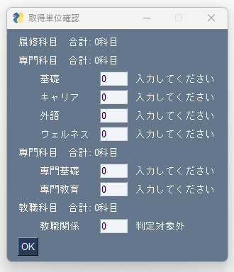

# check-requirement-school-credit-sotsuken
取得単位確認ツール

## 依存パッケージ
`PySimpleGUI`

## 使い方
1. 依存パッケージをインストールする。  
    なお、`requirements.txt`を用いて自動インストールする方法もある。
2. `python main.py`を実行する。
3. myfitの成績確認で単位習得情報に記載されている単位数を入力する。
4. 下部の`OK`ボタンを押す。
5. 入力欄の右側にメッセージが表示され、メッセージすべてが緑字で「必要単位数超過」と表記されると卒業要件を満たしている。
## 製作者
Sou Tamura([tmsou0209](https://github.com/tmsou0209))

## スクリーンショット

